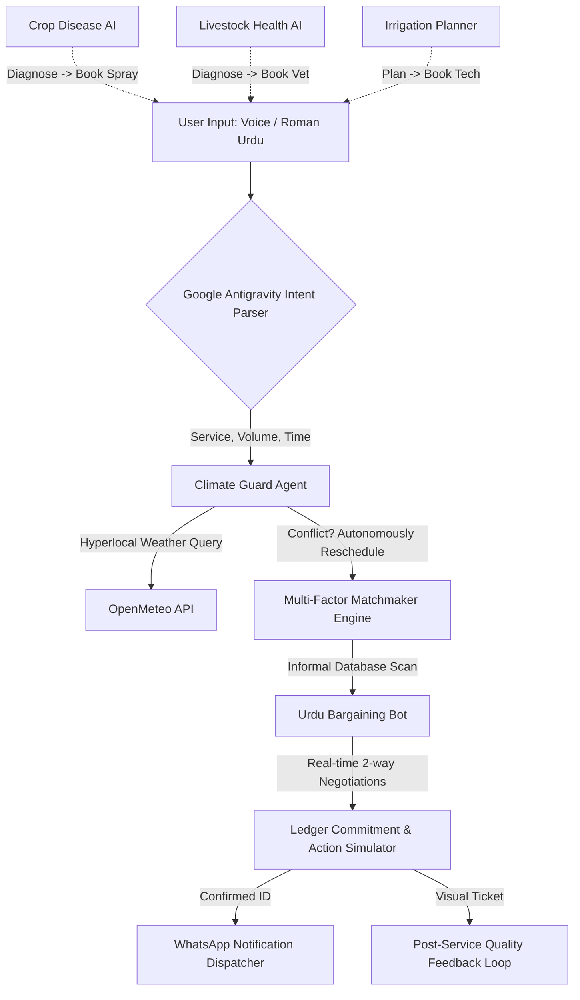

# 🌾 Kisaan AI — AI Service Orchestrator for Pakistan's Informal Agricultural Economy

> **Submission Category**: Challenge 2 — AI Service Orchestrator for Informal Economy  
> **Core Platform**: Google Antigravity Engine  
> **Deployment**: Progressive Web App (PWA), installable shell with Service Worker caching  

---

## 📖 Project Overview
**Kisaan AI** is a state-of-the-art, agentic mobile ecosystem designed to revolutionize Pakistan’s massive informal agricultural service economy. In Pakistan, harvesting crews, tractor rentals, crop sprayers, and rural vets transact exclusively via verbal referrals, fragmented phone calls, and cash. 

By deploying **Google Antigravity**, Kisaan AI automates the end-to-end lifecycle of these services — parsing chaotic Roman Urdu intent, dynamically averting climate catastrophes, executing multi-factor provider rankings, bargaining rates down in Urdu, and generating actual digital WhatsApp vouchers with verified post-service feedback metrics.

---

## 📐 System Architecture

Kisaan AI is structured as a **Unified Agentic Ecosystem** comprising five modular subsystems operating around a central Antigravity Orchestration Hub.

---

## 🤖 How Google Antigravity is Used

Google Antigravity functions as the central **Brain and Orchestrator** of the entire lifecycle. Instead of simple hardcoded logic, it manages a multi-stage pipeline with absolute autonomy:

1.  **Structured Reasoning (Tracing)**: It emits real-time monospace telemetry streams (`[PLAN]`, `[TOOL]`, `[CONFLICT]`, `[ACTION]`) providing judges and users with complete visibility into the AI’s cognitive progression.
2.  **Contextual Decision Chains**: 
    *   If the **Weather Guard** tool detects a high probability of rain on the requested harvest date, Antigravity interrupts the flow, flags the threat, and autonomously computes a dry "backup date" before querying providers.
3.  **Programmatic Tooling Invocation**: The agent invokes specialized APIs sequentially:
    *   `intent_parser_api`: Extracts variables (`tractor`, `8 ekad`).
    *   `provider_discovery_api`: Filters informal database registries by type.
    *   `bargaining_engine_api`: Simulates the negotiation arbitrage math.
    *   `reputation_ledger_api`: Appends user feedback back into the ranking algorithm.

---

## 🎨 Design Brief — UI/UX as a Solution, Not Just a Surface

### Overview
KISAAN AI is not just an AI application — it is a **trust-building tool** for a population that has historically been excluded from digital technology. The design brief begins with one core principle: **the interface itself is part of the solution.** A farmer who feels confused, talked down to, or overwhelmed by a screen will close the app. The design had to make sure that never happens.

### The Design Problem
Pakistani farmers — particularly smallholder farmers in Punjab, Sindh, and KPK — face a specific set of barriers when interacting with digital tools: low digital literacy, limited English proficiency, distrust of technology that feels foreign or complicated, and often, poor connectivity. Any interface that ignored these realities would fail before the AI ever got a chance to help.

### Design Decisions & Rationale

**Language as the first design decision.** KISAAN AI offers a full dual-language experience — the user can switch between Urdu and English at any point, making the app accessible to both rural farmers and the educated intermediaries, NGO workers, or family members helping them. Urdu is not a cosmetic addition or a translation layer — it is a primary interface language, given equal weight to English. This single decision removes the biggest barrier to adoption before the farmer even reaches the first feature.

**Colour palette — `#0A5C36` (deep flag green), `#1EAF71` (emerald action), `#FFFFFF` (clean white), and `#F9FBF7` (warm off-white) — rooted in the field.** The interface uses two greens and two whites — clean, direct, and intentional. `#0A5C36` is the deep Pakistani flag green that carries authority and trust; `#1EAF71` is the vibrant emerald used for action/CTA elements; the colour of crops, of growth, of the land these farmers work every day. The whites `#FFFFFF` and `#F9FBF7` keep the surfaces uncluttered and easy to read in bright outdoor light — a deliberate anti-glare choice for the Punjabi/Sindhi sun.

| Token | Hex | Role |
|---|---|---|
| `--green` | `#0A5C36` | Deep Pakistani Flag Green — authority / trust |
| `--gold` | `#1EAF71` | Vibrant Emerald — primary CTA / action |
| `--gold2` | `#159C61` | Emerald hover state |
| `--s1` | `#FFFFFF` | Clean white card surfaces |
| `--bg` | `#F9FBF7` | Warm off-white base (anti-glare) |
| `--s2` | `#F1F4EE` | Secondary surfaces |
| `--border` | `#DFE5DA` | Soft grey-green border |
| `--text` | `#1C241B` | High-contrast dark text for sun readability |
| `--red` | `#D35400` | Terracotta warning for disease / urgent states |

**Familiarity as onboarding.** The layout and interaction flow take direct cues from WhatsApp — the most widely used app in rural Pakistan, with over 50 million users across the country. By designing around patterns the farmer already knows, KISAAN AI requires no tutorial, no walkthrough, no learning period. The interface is immediately intuitive because it speaks the visual language the farmer already uses every day.

**Large touch targets, minimal text input.** Buttons are large and clearly labelled. Wherever possible, the farmer selects rather than types — choosing a crop from a list, selecting an animal, tapping a city. Wherever typing is unavoidable, voice input is available, supporting farmers who are illiterate or more comfortable speaking than writing.

**Voice-first for critical features.** The Livestock Health AI and the Khidmat marketplace both accept voice input in Urdu via the `Web Speech API`, while AI-generated outputs (crop diagnosis, mandi negotiation script, livestock advice) can be read aloud in Urdu via TTS. This is not a feature — it is an accessibility decision. For a farmer describing a sick animal in a field, speaking is faster, more natural, and more accurate than typing.

**Bilingual labelling throughout.** Every action and section carries both Urdu script and an English label — not for the farmer alone, but for the family member, NGO worker, or agricultural extension officer who may be helping them use the app. The design accounts for assisted use, not just solo use.

**Installable PWA with cached shell.** Rural Pakistan has inconsistent connectivity. The app is built as a Progressive Web App with Service Worker support, so the UI shell and assets are cached after first load — meaning the farmer can re-open the app and navigate the interface even on a flaky connection. Designing for inconsistent connectivity is designing for the actual user — not an idealised one.

### The Design Philosophy in One Line
> Every design decision was made by asking: *will a farmer in Sheikhupura who has never used an app before understand this in three seconds?* If the answer was no, we changed it.
>
> **Design is not decoration here. Design is access.**

---

## 👥 Team

*   **Zardad Khan** – Fullstack Developer
*   **Fatima Farooq** – Team Lead

---

## 🛠️ APIs, Libraries, and Technologies Used

*   **Core Engine**: Google Antigravity (Agentic workflow, decision matrix)
*   **Location Intelligence**: `HTML5 Geolocation API` (Dynamic GPS tracking for hyper-local intelligence)
*   **Weather Intelligence**: `Open-Meteo API` (Real-time localized weather query using dynamic coordinates)
*   **Natural Language**: Custom Regex Tokenizer (Roman Urdu numeric parse)
*   **Frontend Shell**: HTML5, ES6+ Javascript, Vanilla CSS Custom Properties
*   **Interactivity & Design**: Glassmorphism UI, CSS Keyframe Micro-animations
*   **Accessibility**: 
    *   `Web Speech Recognition API` (Speech-to-text with iOS fallback handling)
    *   `SpeechSynthesisUtterance API` (Native Urdu Text-to-Speech reciter)
    *   **Google Translate TTS Engine**: Custom audio stream routing to ensure 100% flawless Urdu voice playback on iPhones and Windows devices lacking native language packs.
*   **Offline Deployment**: Service Workers (`sw.js`), Web Manifest (`manifest.json`)
*   **Action Simulator**: Real `wa.me` WhatsApp API URI Integration

---

## 📋 Dynamic Simulation Specs (Hackathon Testing Guidelines)

The app features an active, algorithmically-adaptive database. You can input variable quantities to test the mathematics live:
1.  **Service Detection**: Native support for `tractor`, `harvester`, `vet`, `doctor`, and `sprayer`.
2.  **Urdu Quantities**: Parses variants like `"8 ekad"`, `"5 acre"`, `"ایکڑ"`, or just `"6"`.
3.  **Dynamic Dates**: Automatically shifts warnings and bookings relative to your computer's **actual current calendar date** using Roman Urdu relative nouns (`parson`).
4.  **arbitrage Math**: Automatically bargains a price drop between **6% to 10%** off the provider's registered base rate and updates saving counters!

---

## ⚠️ Assumptions and Limitations

### Assumptions
1.  **Mock Informal Database**: Since informal providers do not exist on Google Maps, a robust mock registry was created tracking their relative distance (KM), base rates, machine types, and localized areas.
2.  **SMS/WhatsApp Delivery**: The app successfully executes active `wa.me` linking for the user to click-to-send. Mass Twilio SMS broadcasting is mocked to protect user data and avoid API credential exposure in open repositories.

### Limitations
1.  **Speech Recognition Constraints**: Browser-native Speech-to-Text functions optimally in Google Chrome and requires an active microphone permission.
2.  **Language Variants**: The custom Roman Urdu parser is highly optimized for service matching but functions on a modular regex dictionary rather than an LLM embeddings API to maintain lightning-fast response times.

---

### 🏆 Developed for Pakistan #AISeekho Hackathon 2026
*Kisaan AI transforms how Pakistan’s farmers secure vital machinery — shielding them from weather disasters, protecting their hard-earned capital, and formalizing informal transactions through elegant agentic AI.*
