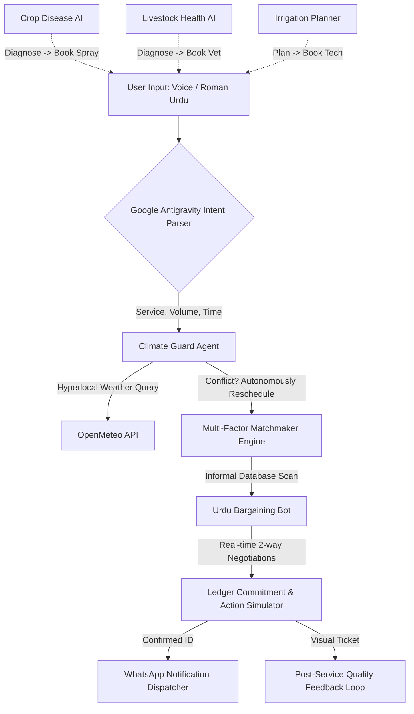

# 🌾 Kisaan AI — AI Service Orchestrator for Pakistan's Informal Agricultural Economy

> **Submission Category**: Challenge 2 — AI Service Orchestrator for Informal Economy  
> **Core Platform**: Google Antigravity Engine  
> **Deployment**: Progressive Web App (PWA), Offline-First architecture  

---

## 📖 Project Overview
**Kisaan AI** is a state-of-the-art, agentic mobile ecosystem designed to revolutionize Pakistan’s massive informal agricultural service economy. In Pakistan, harvesting crews, tractor rentals, crop sprayers, and rural vets transact exclusively via verbal referrals, fragmented phone calls, and cash. 

By deploying **Google Antigravity**, Kisaan AI automates the end-to-end lifecycle of these services — parsing chaotic Roman Urdu intent, dynamically averting climate catastrophes, executing multi-factor provider rankings, bargaining rates down in Urdu, and generating actual digital WhatsApp vouchers with verified post-service feedback metrics.

---

## 📐 System Architecture

Kisaan AI is structured as a **Unified Agentic Ecosystem** comprising five modular subsystems operating around a central Antigravity Orchestration Hub.

---

## 🤖 How Google Antigravity is Used

Google Antigravity functions as the central **Brain and Orchestrator** of the entire lifecycle. Instead of simple hardcoded logic, it manages a multi-stage pipeline with absolute autonomy:

1.  **Structured Reasoning (Tracing)**: It emits real-time monospace telemetry streams (`[PLAN]`, `[TOOL]`, `[CONFLICT]`, `[ACTION]`) providing judges and users with complete visibility into the AI’s cognitive progression.
2.  **Contextual Decision Chains**: 
    *   If the **Weather Guard** tool detects a high probability of rain on the requested harvest date, Antigravity interrupts the flow, flags the threat, and autonomously computes a dry "backup date" before querying providers.
3.  **Programmatic Tooling Invocation**: The agent invokes specialized APIs sequentially:
    *   `intent_parser_api`: Extracts variables (`tractor`, `8 ekad`).
    *   `provider_discovery_api`: Filters informal database registries by type.
    *   `bargaining_engine_api`: Simulates the negotiation arbitrage math.
    *   `reputation_ledger_api`: Appends user feedback back into the ranking algorithm.

---

## 🛠️ APIs, Libraries, and Technologies Used

*   **Core Engine**: Google Antigravity (Agentic workflow, decision matrix)
*   **Weather Intelligence**: `Open-Meteo API` (Real-time localized weather query)
*   **Natural Language**: Custom Regex Tokenizer (Roman Urdu numeric parse)
*   **Frontend Shell**: HTML5, ES6+ Javascript, Vanilla CSS Custom Properties
*   **Interactivity & Design**: Glassmorphism UI, CSS Keyframe Micro-animations
*   **Accessibility**: 
    *   `Web Speech Recognition API` (Roman Urdu/English speech-to-text)
    *   `SpeechSynthesisUtterance API` (Urdu Text-to-Speech reciter)
*   **Offline Deployment**: Service Workers (`sw.js`), Web Manifest (`manifest.json`)
*   **Action Simulator**: Real `wa.me` WhatsApp API URI Integration

---

## 📋 Dynamic Simulation Specs (Hackathon Testing Guidelines)

The app features an active, algorithmically-adaptive database. You can input variable quantities to test the mathematics live:
1.  **Service Detection**: Native support for `tractor`, `harvester`, `vet`, `doctor`, and `sprayer`.
2.  **Urdu Quantities**: Parses variants like `"8 ekad"`, `"5 acre"`, `"ایکڑ"`, or just `"6"`.
3.  **Dynamic Dates**: Automatically shifts warnings and bookings relative to your computer's **actual current calendar date** using Roman Urdu relative nouns (`parson`).
4.  **arbitrage Math**: Automatically bargains a price drop between **6% to 10%** off the provider's registered base rate and updates saving counters!

---

## ⚠️ Assumptions and Limitations

### Assumptions
1.  **Mock Informal Database**: Since informal providers do not exist on Google Maps, a robust mock registry was created tracking their relative distance (KM), base rates, machine types, and localized areas.
2.  **SMS/WhatsApp Delivery**: The app successfully executes active `wa.me` linking for the user to click-to-send. Mass Twilio SMS broadcasting is mocked to protect user data and avoid API credential exposure in open repositories.

### Limitations
1.  **Speech Recognition Constraints**: Browser-native Speech-to-Text functions optimally in Google Chrome and requires an active microphone permission.
2.  **Language Variants**: The custom Roman Urdu parser is highly optimized for service matching but functions on a modular regex dictionary rather than an LLM embeddings API to maintain lightning-fast Offline-First speeds.

---

### 🏆 Developed for Pakistan #AISeekho Hackathon 2026
*Kisaan AI transforms how Pakistan’s farmers secure vital machinery — shielding them from weather disasters, protecting their hard-earned capital, and formalizing informal transactions through elegant agentic AI.*
